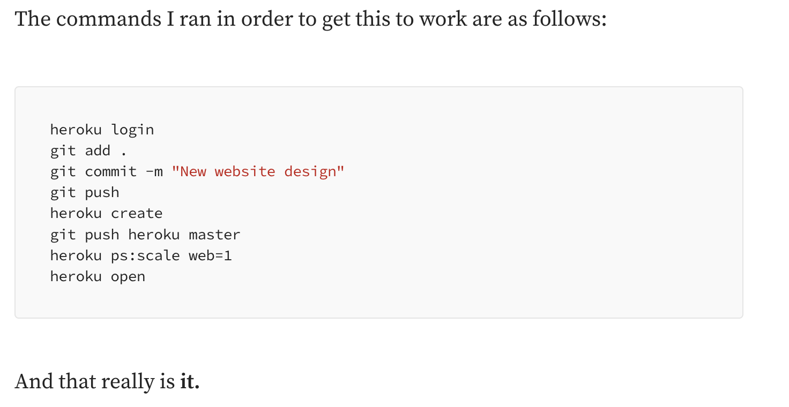
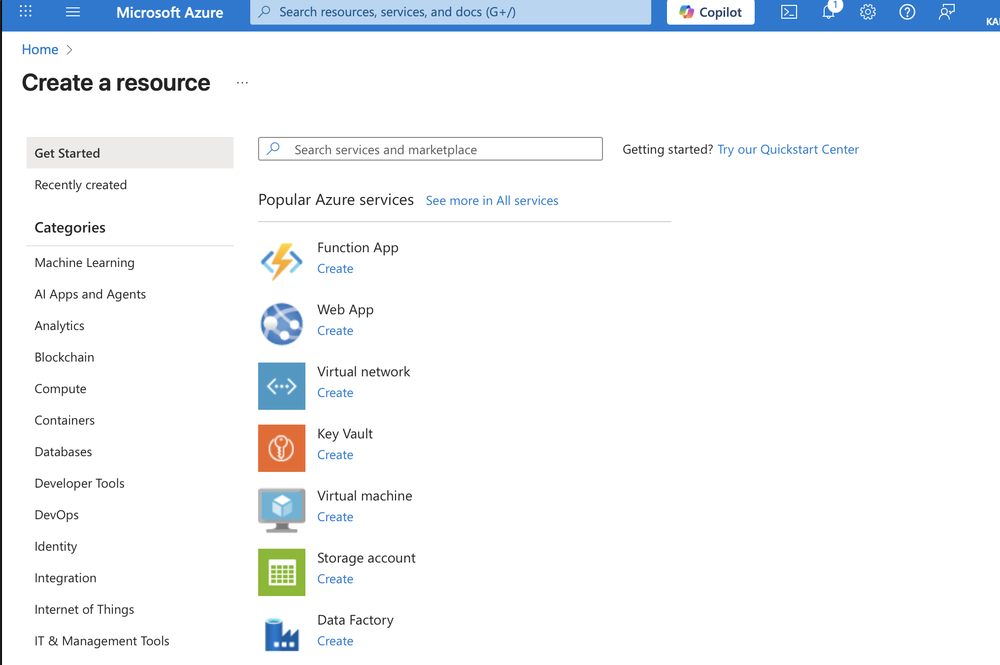

# Platform Engineering
## Building the Foundation for Developer Excellence

---

## What does Platform Engineering mean to you?

---

> "Platform Engineering is the process of designing and building re-usable tools, processes and infrastructure that enables self-service capabilities for software engineering teams"

**Key Goals**: Stability, Developer Enablement & DevEx, Speed, Standardisation

---
## The Problem We're Solving

- **Developer Toil**: Too much time spent on infrastructure, tooling, and deployment
- **Inconsistent Practices**: Teams solving the same problems differently
- **Slow Delivery**: Complex deployment pipelines and environment setup
- **Security & Compliance**: Manual processes lead to gaps and risks
- **Centralised Opinionated Worldview**: What does good look like?
- **Building things!**

---

## Key Goals

**Stability**: The business cares about uptime! 

> Builds on the agile manifesto idea that working software comes before all else.

---

## Key Goals

**Developer Enablement**: How do we reduce the number of "I need a..." requests

> Focusses on tooling and workflows to enable developers to build the things that they need.

---

## Key Goals

**DevEx (Developer Experience)**: Make developers' lives easier!

> Focus on reducing friction and cognitive load, how do we make using our platform the best it can be?

---

## Key Goals

**Speed**: Metrics metrics and more metrics

> Time to first deployment, lead time for changes, deployment frequency, pipeline duration, high velocity. 

---

## Key Goals

**Standardisation**: Consistency across teams and projects!

> Establish golden paths and best practices that reduce variability and increase predictability.

---

## Core Principles

- **Developer Self-Service** - Empower teams with autonomy
- **Golden Paths** - Opinionated, best-practice workflows
- **Abstractions** - Hide complexity, expose simplicity
- **Product Mindset** - Internal platforms as products
- **Measurement** - Data-driven platform evolution

---

## Platform Components

### 🏗️ **Infrastructure as Code**
- Terraform, Pulumi, CDK
- Standardized environments

### 🚀 **CI/CD Pipelines**
- Automated testing & deployment
- Security scanning integration

---
## Platform Components

### 📊 **Observability**
- Monitoring, logging, tracing
- Performance insights

### 🔐 **Security & Compliance**
- Policy as code
- Secret management
- Vulnerability scanning

---
## Platform Components

### 📚 **Developer Portals**
- Service catalogs
- Documentation
- Self-service workflows

### 🛠️ **Toolchain Integration**
- CLI tools
- APIs

---

## Benefits of Platform Engineering

### 👩‍💻 For Developers
- **Faster Time to Production** - Minutes, not weeks
- **Reduced Cognitive Load** - Focus on business logic  
- **Consistent Experience** - Same tools, same patterns

---
## Benefits of Platform Engineering

### 🏢 For Organizations
- **Improved Velocity** - Faster feature delivery
- **Better Security** - Built-in best practices
- **Cost Optimization** - Efficient resource usage

---

## The Future: AI-Native Platforms

🤖 **Intelligent Automation**
- AI-powered incident response
- Predictive scaling
- Automated code reviews

🔮 **Next-Gen Developer Experience**
- Natural language infrastructure
- AI pair programming for ops
- Intelligent troubleshooting

---

# What **Platform Engineering** is *not*

---
## ChatGPT, how do I get my app on localhost:3000 available on the internet?

---

## Heroku

This will give you an **application available on the internet!**

What's **wrong** with this?

---

## Fast or built to last?
You  can get something "live" fast and easily. 

Platform Engineering builds the foundation for sustainable, scalable, and reliable software delivery, how we build things in the real world.
> You must think first, before you move

---

## Understanding HLD, LLD & F/NFRs

> Measure Twice, Cut Once

These artifacts help us:
- Communicate design decisions
- Ensure requirements are met
- Guide implementation
- Document for future teams

---

## High-Level Design (HLD)

**What is it?**
- Bird's-eye view of the system architecture
- Focus on major components and their interactions

**Key Contents:**
- System architecture diagrams
- Component relationships
- Data flow
- Technology stack decisions
- Integration points

---

## Low-Level Design (LLD)

**What is it?**
- Detailed technical specifications
- Implementation details for each component
- APIs, data models, algorithms

**Key Contents:**
- Detailed class/module designs
- Database schemas
- API specifications (endpoints, payloads)
- Sequence diagrams
- Error handling strategies

---

## Functional Requirements (FRs)

**What are they?**
- Define WHAT the system must do
- Specific features and capabilities
- User-facing functionality and behaviors

---

**Key Aspects:**
- ✅ **User Actions** - Login, deploy, configure
- 🔄 **System Behaviors** - Process requests, store data
- 📝 **Business Rules** - Validation, workflows
- 🔌 **Integrations** - External systems, APIs

---

## Functional Requirements (FRs)

**Example FRs for a Platform:**
- Users must be able to deploy applications via CLI or UI
- System must support multiple environments (dev, staging, prod)
- Platform must integrate with GitHub for source control
- Users can view deployment logs in real-time
- System must send notifications on deployment completion
- Support rollback to previous versions

**Focus**: WHAT features the platform provides

---

## Non-Functional Requirements (NFRs)

**What are they?**
- Quality attributes and constraints
- Not about WHAT the system does, but HOW WELL it does it
- Critical for platform success

---

**Key Categories:**
- ⚡ **Performance** - Response times, throughput
- 📈 **Scalability** - Handle growth
- 🔐 **Security** - Authentication, encryption
- 🛡️ **Reliability** - Uptime, disaster recovery

---

## What is the "Cloud"?

---
# The Ultimate Platform

**Cloud computing**  allows us to provision complex pyhiscal infrastructure "virtually"

What do I mean by **"cloud vendors offer the ultimate platform?"**

--- 

## Azure Example

---

**Key Benefits:**
- 🚀 **Scalability** - Scale resources up or down instantly
- 💰 **Cost Efficiency** - Pay only for what you use
- 🌍 **Global Reach** - Deploy anywhere in the world
- ⚡ **Speed & Agility** - Provision resources in minutes

---

## Cautions

- Security and Privacy
- Cost concerns
- Vendor lock-in
- Ownership and control
- Compatibility

---

## Cloud Deployment Models
--- 

### ☁️ **Public Cloud**
- Infrastructure owned by cloud provider
- Resources shared across multiple organizations
- Examples: AWS, Azure, GCP
- **Best for**: Previously mentioned key benefits!

---

### 🏢 **Private Cloud**
- Dedicated infrastructure for single organization
- Greater control and security
- Can be on-premises or hosted
- **Best for**: Regulated industries, sensitive data
---

### 🔀 **Hybrid Cloud**
- Combination of public and private clouds
- Data and applications can move between environments
- **Best for**: Flexibility, compliance requirements, gradual migration

---

## Major Cloud Vendors

### ☁️ **Amazon Web Services (AWS)**
- Market leader, launched 2006
- 200+ services, largest market share

### ☁️ **Microsoft Azure**
- Enterprise-focused, excellent Microsoft integration
- Strong hybrid cloud capabilities

---

## Major Cloud Vendors

### ☁️ **Google Cloud Platform (GCP)**
- Data analytics and ML expertise
- Strong Kubernetes support (created K8s)

### ☁️ **Others**
- IBM Cloud, Oracle Cloud, Alibaba Cloud
- Digital Ocean, Linode (simpler, developer-focused)

---

## Putting It All Together

**Platform Engineering Workflow:**

1. **Define Requirements** - NFRs, business needs
2. **Design** - Architecture, components, implementation
3. **Build** - Implement the requirements
4. **Document** - ADRs, guides, runbooks
5. **Iterate** - Continuous improvement