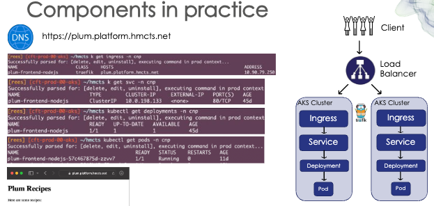

# Into the Cloud
## Deployment for images

---

## As things stand

- Built Docker images
- Optimized image sizes
- Pushed to container registries
- Managed versions and tags
---

### **Next Challenge: Where Do Containers Actually Run?**

> Your image is ready. Now you need to deploy it to Azure!

---

## The Deployment Landscape

Azure offers a **spectrum of options** from simple to  more complex.

**Less Control, Less Management**
- Azure Container Instances (ACI)
- Azure App Service
- Azure Container Apps

---

You tend to get more control the more complex it gets! 

**More Control, More Complexity**

Managed Kubernetes on Azure
- Azure Kubernetes Service (AKS)

---

## Understanding Container Engines

**You've been using Docker - but what's actually running your containers?**

A container engine is the software that:
- Creates containers from images
- Manages container lifecycle
- Handles networking and storage
- Enforces resource limits

---

### **Popular Container Engines**

| Engine | Description | Use Case |
|--------|-------------|----------|
| **Docker** | Most popular, easy to use | Development & simple deployments |
| **containerd** | Lightweight, industry standard | Production, Kubernetes |
| **CRI-O** | Kubernetes-native | Kubernetes-only environments |
| **Podman** | Daemonless, rootless | Security-focused deployments |

> **Azure uses containerd** under the hood for AKS and Container Apps!

---

### **Docker vs containerd**

**Docker:**
- Full-featured development platform
- Built-in networking, volumes, compose
- Higher overhead

**containerd:**
- Minimal runtime (Docker uses it internally!)
- Industry standard for production
- Lower resource usage

---

## Understanding DNS

### **What is DNS?**

---

**DNS = Domain Name System**

Think of it as **the internet's phonebook**

- Computers communicate using IP addresses (like `20.123.45.67`)
- Humans prefer names (like `myapp.azurecontainerapps.io`)
- DNS translates names to IP addresses automatically
--- 
> Without DNS, you'd need to remember `172.217.16.206` instead of `google.com`!

---

### **How DNS Works in Practice**

**When someone wants to access your application:**

1. **Your application is typically behind public or private IP address**
   - Example: `20.123.45.67`

2. **DNS maps a friendly name to that IP:**
   - User types: `www.myapp.com`
   - DNS translates: "That's `20.123.45.67`"
   - Browser connects to the IP address

---

### **Setting Up DNS: The Traditional Way**

**To make your container accessible on the internet, you would typically need to:**

**1. Buy a domain name:**
- Register through a registrar (GoDaddy, Namecheap, etc.)
- Annual cost: £10-50+
- Manage renewals

---

**2. Configure DNS records:**
- Create A records (domain → IP address)
- Set up CNAME records (aliases)
- Wait for DNS propagation (can take hours!)

---

**3. Set up HTTPS/SSL:**
- Purchase SSL certificate OR use free Let's Encrypt
- Install certificate on your server
- Configure web server for HTTPS
- Renew certificates before expiry (every 90 days for Let's Encrypt)

**4. Keep everything updated:**
- If your server IP changes, update DNS
- Monitor certificate expiry
- Troubleshoot DNS issues

---

### **How Cloud Platforms Help**

**Automatic DNS names:**
- Platform provides a domain automatically
- No need to buy or configure initially
- Example pattern: `yourapp.platform-name.azure.com`

**Managed HTTPS/SSL:**
- Certificates provided and managed
- Automatic renewal
- HTTPS works out of the box

---

**Easy custom domains with DNS zones (when you're ready):**
- Simple process to add your own domain
- Guided setup
- Certificate management included

**What this means:**
- Deploy in minutes instead of hours
- No DNS expertise required to start
- Security (HTTPS) by default
- Focus on building, not infrastructure setup

---

### **How Azure Simplifies DNS**

**Azure container services make this much easier:**

**Automatic DNS provided:**
- **ACI:** `your-label.region.azurecontainer.io`
- **App Service:** `yourapp.azurewebsites.net`
- **Container Apps:** `yourapp.region.azurecontainerapps.io`

**HTTPS included by default:**
- Managed SSL certificates
- Automatic renewal
--- 

## Caveats!

Whilst the quick Azure given DNS is nice, it is not best practice to use these for clients and customer facing endpoints. How many websites do you visit that have Azure or AWS in the name?

https://facebook.azure.z35.windows.net doesn't quite sound as good

In the real world, you use custom domains

---

## Azure Container Instances (ACI)

### **Fastest Way to Run a Container**

- Deploy a container in seconds (managed DNS!)
- No servers to manage
- Pay per second of execution
- Great for simple workloads, proof of concepts, or learning!

---

### **When to Use ACI**

**✅ Perfect for:**
- Quick demos and testing
- Batch jobs and scheduled tasks
- CI/CD build agents
- Simple background workers
- Isolated task execution

---

**❌ Not ideal for:**
- High-traffic web applications
- Complex multi-container applications
- Applications requiring auto-scaling
- Long-running production services

---

### **ACI Key Features**

**Resource Control:**
- Specify exact CPU cores and memory
- Pay only for what you provision

**Networking:**
- Public IP addresses
- Virtual network integration
- DNS name labels
---

## Azure App Service

### **Platform-as-a-Service for Web Apps**

**Managed platform for hosting applications:**
- Deploy containers or code
- Built-in scaling and load balancing
- Integrated monitoring and diagnostics
- SSL/TLS certificates included

---

### **When to Use App Service**

**✅ Perfect for:**
- Web applications and APIs
- Microservices with HTTP endpoints
- Applications needing custom domains
- Teams wanting managed infrastructure
- Applications requiring staging slots

---

**❌ Not ideal for:**
- Non-HTTP workloads
- Complex container orchestration
- Batch processing jobs
- Applications needing full Kubernetes features

---

### **App Service Key Features**

**Developer-Friendly:**
- Deploy from GitHub, Azure DevOps, Docker Hub
- Automatic OS and runtime patching
- Built-in authentication/authorization
- Easy rollback to previous versions

---

**Enterprise-Ready:**
- Auto-scaling (vertical and horizontal)
- Traffic splitting for A/B testing
- Deployment slots (dev, staging, production)
- VNet integration for secure networking

**Cost-Effective:**
- Shared infrastructure tier available
- Scale up/down based on demand
- Only pay for the App Service Plan

---

## Azure Container Apps

### **The Modern Container Platform**

**Built on Kubernetes, without the Kubernetes complexity:**
- Microservices-first design
- Event-driven scaling (including to zero!)
- Built-in service discovery
- Managed by Microsoft

---

### **When to Use Container Apps**

**✅ Perfect for:**
- Modern microservices architectures
- Event-driven applications
- Applications with variable traffic
- Teams wanting Kubernetes benefits without complexity
- HTTP and background processing workloads

---

**❌ Not ideal for:**
- Applications requiring full Kubernetes control
- Windows containers (Linux only)
- Stateful applications requiring persistent storage
- Complex custom networking requirements

---

### **Container Apps Key Features**

**Built for Modern Apps:**
- Multiple containers in one application
- Automatic HTTPS ingress
- Service-to-service communication
- Integrated with KEDA for event scaling

---

**Developer Experience:**
- Scale to zero (pay nothing when idle!)
- Revisions for versioning and rollback
- Traffic splitting between revisions
- Logs and metrics out of the box

**Environmentally Isolated:**
- Create environments for different stages (dev, test, prod)
- Shared resources within an environment
- VNet integration for security

---

### **Container Apps Scaling**

**Dynamic and Event-Driven:**

Scales based on:
- HTTP traffic load
- Queue length (Azure Storage Queue, Service Bus)
- Custom metrics (CPU, memory)
- Scheduled times
- Other event sources via KEDA

---

**Scale to Zero:**
- When no requests = no running containers = no cost!
- Wakes up automatically when traffic arrives
- Perfect for intermittent workloads

---

## Azure Kubernetes Service (AKS)

### **Enterprise Container Orchestration**

**Fully-managed Kubernetes on Azure:**
- Complete Kubernetes experience
- Maximum control and flexibility
- Industry-standard platform
- Microsoft manages the control plane

---

### **What is Kubernetes?**

**Container orchestration at scale:**
- Manages hundreds or thousands of containers
- Automatic load balancing
- Self-healing (restarts failed containers)
- Secret and configuration management
- Storage orchestration

> **Kubernetes** is like a data center operating system for containers!

---

### **When to Use AKS**

**✅ Perfect for:**
- Large-scale microservices applications
- Complex multi-container applications
- Teams with Kubernetes expertise
- Applications requiring advanced networking
- Stateful applications needing persistent storage
- Multi-region deployments

---
 
**❌ Not ideal for:**
- Simple single-container applications
- Teams new to containers (steep learning curve!)
- Small projects with limited resources
- Quick prototypes or MVPs

---

### **AKS Architecture**

**Key Kubernetes Concepts:**

**Pods:** Smallest unit - one or more containers running together
**Services:** Expose pods to network traffic
**Deployments:** Manage pod replicas and updates
**Namespaces:** Isolate resources within cluster
**Ingress:** HTTP routing to services

---

**AKS Node Pools:**
- Worker nodes that run your containers (Virtual Machines running Containers? We're really in the cloud now)
- Can have multiple pools with different VM sizes
- Automatically managed and patched by Azure

---

---

## Real-World Scenarios

Which deployment option to use?

---

### **Scenario 1: Startup MVP**

**Context:** Small team, limited budget, simple API, simple frontend?

---

**Best choice:** Azure Container Apps
- Quick to deploy
- Scales to zero when not in use
- Easy to add more services later
- No Kubernetes complexity

---

### **Scenario 2: Batch Data Processing**

**Context:** Nightly data processing job, runs for 2 hours

---

**Best choice:** Azure Container Instances
- Spin up when needed
- Run job, then terminate
- Pay only for 2 hours
- No idle infrastructure costs

---

### **Scenario 3: Complex Microservices Platform**

**Context:** 100+ microservices, dedicated DevOps team, multi-region

---

**Best choice:** Azure Kubernetes Service
- Can handle complexity
- Team has Kubernetes skills
- Need advanced networking
- Require custom operators and tools