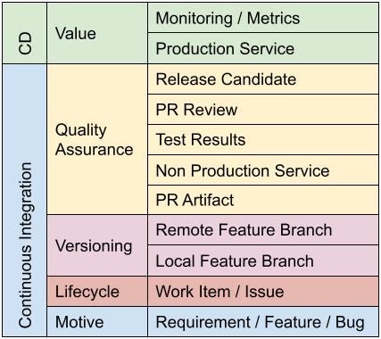
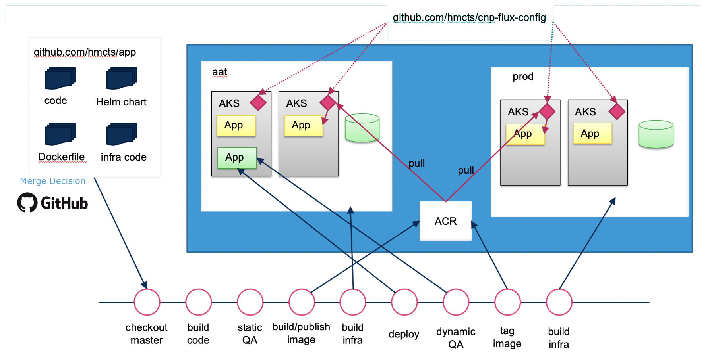

# CI/CD & Automation
## From Code to Production

---

## Where We Are Now

### **Manual Deployments**

- Writing Terraform manually
- Running commands locally
- Copying files between environments
- Relying on each user's setup to work

---

### **The Problems**

- Human error (we all have a story, even with perfect CI/CD!)
- Inconsistency
- No audit trail
- Slow feedback loops
- "Works on my machine"

---

### **Automate everything**

> **CI/CD packages your workflow into a re-usable, opinionated, and consistent set of tools**

It's how we make sure everyone uses the same road to get from A to B,avoiding traffic, crashes, dead ends, with frequent mechanic stops.

---

**What we look to build:**
- Automated testing on every change
- Consistent deployment processes
- Fast feedback for developers
- Audit trail of all changes
- Confidence in production releases

---

## What is CI/CD?

It's made up of two parts:

---

### **Continuous Integration (CI)**

**The practice of frequently merging code changes:**

**Developer workflow:**
1. Write code locally, commit and push to repository
2. Pipelines handle the rest
   - Downloads code, runs all tests, checks code quality
   - Builds artifacts (containers, packages)
   - Reports results immediately

---

###  **Continuous Deployment (CD)**

**Automatically releasing validated changes**

1. **Pipelines continue:**
   - Deploys to testing environment, runs integration tests
   - Promotes to higher environments
   - Runs acceptance tests
   - Deploys to production

**Goal:** Reduce time from code to live deployment

---

### **The Complete Pipeline**

---

## Why CI/CD adds value

### **Speed and Frequency**
Removes the need for:
- Monthly or quarterly releases
- Big bang deployments
- High risk, high stress
- Long feedback cycles

---

**Instead it  enables:**
- Multiple deployments per day
- Small, incremental changes
- Lower risk per deployment
- Fast feedback and iteration

You attain the ability to also rollback breaking changes quickly, enabling you to take a little more calculated risk in deployment frequency 
> **Companies like Netflix deploy thousands of times per day!**

---

### **Quality and Reliability**

**Automate your quality gates:**
- All your tests run on code push to verify components work
- Security scans identify vulnerabilities
- Performance tests prevent regressions
- Code quality checks maintain standards

---

**Consistent environments:**
- Same process for dev, test, and production
- Infrastructure as Code ensures consistency
- No "deployment drift" between environments

---

### **Visibility and Auditing**
Massively important, what if you broke something but aren't sure exactly which change you made locally caused it?

**Every change is tracked:**
- Who made the change?
- What exactly changed?

This lets you revert a breaking change, and automatically run everything you need to get things working again

---

## Principles we'd love you to be aware of

### **Build Once, Deploy Everywhere**

1. Build application artifact once (container image, terraform plan, etc)
2. Test that exact same artifact
3. Deploy that same artifact to all environments
4. No rebuilding between environments

---

### **Fail Fast**

- Run fastest tests first
- Stop pipeline on first failure
- Provide immediate feedback
- Don't waste time on broken builds

Think of the developer at all times, how can we save them the most time.

Should we bother running an entire test suite if we've spotted a CVE in the code?

--- 

### **Monitoring and alerting:**

- Health checks during deployment
- Performance monitoring
- Automated incident response

---

### **Measure Everything**

This comes a bit later on but having it in mind early can inform your other decisions

**DORA metrics (industry standard):**
- **Deployment frequency**
- **Lead time:** Code commit to production
- **MTTR:** Mean time to recovery from failures
- **Change failure rate:** % of deployments causing issues

----

**Quality metrics:**
- Test coverage and pass rates
- Build success rates
- Security vulnerability counts
- Performance benchmarks

---

| Platform | Best For | Strengths | Considerations |
|----------|----------|-----------|----------------|
| **GitHub Actions** | GitHub repositories | Native integration, marketplace | GitHub-centric |
| **Azure DevOps** | Microsoft ecosystem | Enterprise features, work tracking | Learning curve, management |
| **Jenkins** | On-premises, flexibility | Highly customizable, plugins | Maintenance overhead, very specific|
| **CircleCI** | Fast builds | Performance, Docker support | Cost at scale |
| **Travis CI** | Open source projects | Simple setup, free tier | Limited features |

---

###  **That's a lot of stuff, how do we build it?**

**Everything as code**
- Shared pipeline tools (think scripts, jobs, functionality)
- Common build stages
- Centralised main library / templates

**Parameterized pipelines:**
- Environment-specific configurations
- Feature flags and toggles

---

## Security in CI/CD
It works pretty nicely when you have this on your laptop, but how do we scale that out to more than just ourselves?

**Dedicated secret handling tools**
- Encrypted storage
- Access control and auditing
- Automatic rotation
- Least privilege access

--- 

We pull our secrets in from these sources during a pipeline run, we **never** store our secrets in code.

Good practice can also involve local pre-commit hooks. that we ask developers to install to add another layer of protection.

---
### **Services to use**

Since we're focussed on Azure in this academy, typical tools include:

- Azure Key Vault
- Hashicorp Vault
- GitHub Secrets

Each cloud provider tends to have their own offering for secret management

---
### Azure Key Vault

Cloud native option that offers integrated support for role based access, secret and certificate management, soft delete and audit history and integrates well with other Azure services

You can view, update, and rollback your secrets very easily

---
### GitHub Secrets

You can add a secret to a repository or at an organisation level

They are **write-only** which can be difficuly for debugging

Tends to be powerful for getting started or proving something, but difficult at scale

---
### Hashicorp Vault

Since we looked at another popular Hashicorp product, Terraform, they also offer a secret management product

More management overheads, tends to have strong functionality

Another frequent third party tool to achieve this used in industry

---

### **I accidentally committed my secret!**

- Has probably happened to us all at some point, you must act quickly rather than hide in shame
- Rotate the secret in question immediately so that no one else can use the one you leaked

---

### **GitOps**

I've used GitHub, what's GitOps?

Git as the **single source of truth** which gives us a foundation to build all this cool stuff

1. Developers push config changes to Git
2. GitOps agent detects changes
3. Agent applies changes
4. System works to put things into the desired state

Have a read about "Flux" if you get time!

---
### **How it looks at scale in practice**

---

## Discussion Points

### **Think About**

1. What manual processes could you automate? Pipelines can be used for all sorts.
2. How would you handle pipeline failures?
3. Why do we need CI/CD?